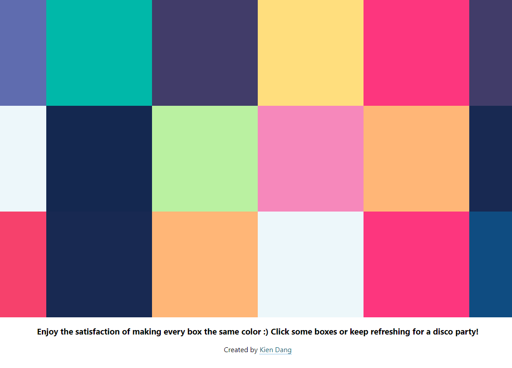

## Disco Colour Box

A simple React project to click on boxes of colours

  <a href="https://kien-disco-boxes.netlify.com/">Live Demo</a>

  

## 👨‍🎓What I learned:

- Practicing passing props from parent to child
- Learned how to pass template literals to inline CSS
